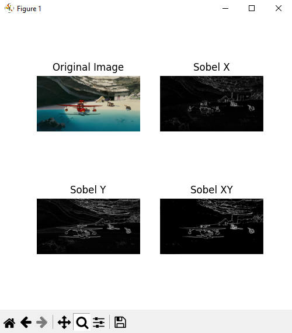

# Sobel Image Filter

This Python project applies different Sobel filters to an image and instantly shows the result.



## Installation

1. Clone the repository:

  ```bash
  git clone https://github.com/david-sfernandes/sobel_img_filter.git
  ```

2. Navigate to the project directory:

  ```bash
  cd sobel_img_filter
  ```

3. Install the required dependencies:

  ```bash
  pip install -r requirements.txt
  ```

## Usage

1. Place the image you want to apply the Sobel filters to in the project directory.

2. Run the following command:

  ```bash
  python sobel_filter.py <image_filename>
  ```

  Replace `<image_filename>` with the actual filename of your image.

  OR

  Just run with the example image

   ```bash
  python sobel_filter.py
  ```

3. The filtered images will prompt on your window.

## Contributing

Contributions are welcome! If you have any suggestions or improvements, please open an issue or submit a pull request.

## License

This project is licensed under the [MIT License](LICENSE).
